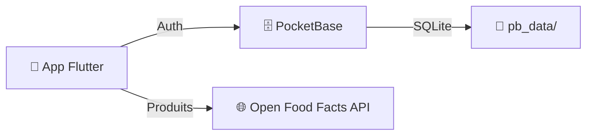
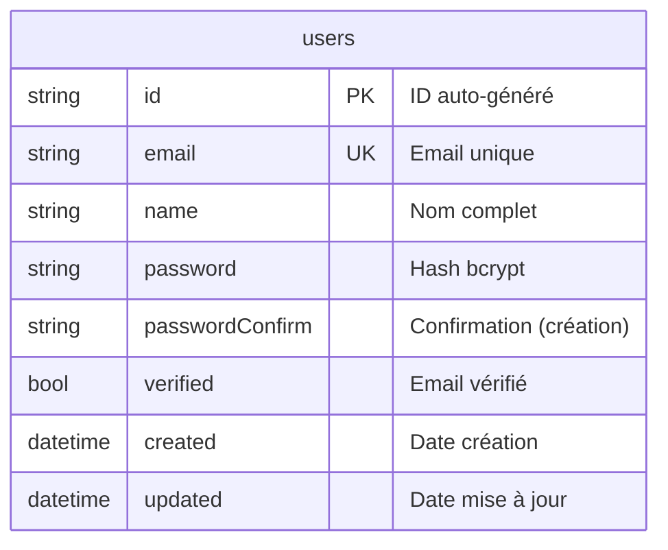
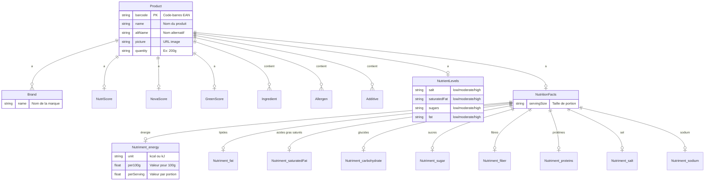
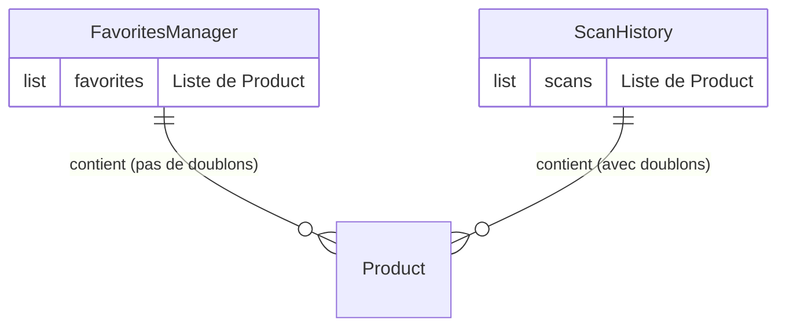

# Schéma de la Base de Données — Yuka Clone

## Architecture



---

## PocketBase — Collection `users`



| Champ | Type | Contraintes | Description |
|-------|------|-------------|-------------|
| `id` | `string` | PK, auto | Identifiant unique |
| `email` | `string` | UNIQUE, NOT NULL | Email de connexion |
| `name` | `string` | NOT NULL | Nom affiché |
| `password` | `string` | NOT NULL, bcrypt | Mot de passe hashé |
| `verified` | `bool` | default: false | Vérification email |
| `created` | `datetime` | auto | Date de création |
| `updated` | `datetime` | auto | Dernière modification |

---

## Open Food Facts API — Modèle `Product`



---

## Données en mémoire (runtime)



> **Note :** Les favoris et l'historique de scan sont stockés en mémoire (dans des singletons Dart). Ils ne sont pas persistés dans PocketBase.

---

## Flux de données

```mermaid
sequenceDiagram
    participant U as Utilisateur
    participant A as App Flutter
    participant PB as PocketBase
    participant OFF as Open Food Facts

    U->>A: Email + Mot de passe
    A->>PB: POST /api/collections/users/auth-with-password
    PB-->>A: Token JWT

    U->>A: Scanne code-barres
    A->>OFF: GET /v2/getProduct?barcode=XXX
    OFF-->>A: JSON produit complet
    A->>A: Ajoute à l'historique (mémoire)

    U->>A: Tap ⭐ favori
    A->>A: FavoritesManager.toggleFavorite()
```
